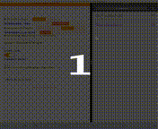

# StatusBarNotificationCenter

[](http://cocoapods.org/pods/StatusBarNotificationCenter)
[](http://cocoapods.org/pods/StatusBarNotificationCenter)
[](http://cocoapods.org/pods/StatusBarNotificationCenter)



You may also want to check this short  [Youtube Video] (https://youtu.be/Qk2vhrBAyps?list=PLy5xoZi6fpzJ0z2xtlqL9Hz86IrpZuksG) to see what it can generally do

You can also check this short [Youtube Video] (https://youtu.be/vtMWcWVtxZ8) to learn more about its implementation detail

`StatusBarNotificationCenter` is a library that can be used in your application to show customized status bar notification.

**NOTE:**During out software development, we want to find a library that can show notification from the status bar,  This project learned many thought from  the popular [`CWStatusBarNotification`](https://github.com/cezarywojcik/CWStatusBarNotification)  library, but with much cleaner code implementation(in my own option) and fully written in **Swift 2.0**,  and more extendable, and also it comes with more customisation options, and support multitasking and split view comes with iOS9+ . You can check it if you want to find a custom status bar notification library.

## Key Feature
1. Support split view of iPad Air and iPad Pro
2. Support concurrency, with version 1.1.0, you can just test it with the demo application
3. Highly customizable with a simple architecture, just a main class with a few class methods
4. Fully documented

**Now, you can let the users interact with the app during the notification is showing by setting the userInteractionEnabled flag of thee StatusBarNotificationCenter configuration, and you can check the latest commit to say how easy it is to add this functionality**

## A few words
This library is just a center class with a window and a view controller, and the center maintains an notification queue, I think our main aim is to build a stable and maintainable architecture, I want to add as many functionality as well, but I really like simple architecture, so there has to be some balance, and I am a programmer just for a few months, so there maybe some thing that maybe not appropriate, if you have some advice, please contant me with my email, you can easily add your custom view to this library, if you have something great to share, please open an issue or submit a pull request, thanks for your support.

## Example

To run the example project, clone the repo, and run `pod install` from the Example directory first.

This example is best run with an iPad air or iPad Pro in portrait mode, and you can test the split view

##Requirements
Because the demonstration code is written with UIStackView, so you need Xcode 7.0+ and iOS 9.0+ to run the demo, But I think this library can be used with devices with system version 7.0+, because the API is rather basic, and you can modify the source code with little effort to accompany with your minimum deployment target.

Works on iPhone and iPad

## Installation

StatusBarNotificationCenter is available through [CocoaPods](http://cocoapods.org). To install
it, simply add the following line to your Podfile, because this is written in Swift 2.0, you may also need to insert `use_frameworks!` in your Podfile:

```ruby
pod "StatusBarNotificationCenter"
```
##Usage

First, you need to import the `StatusBarNotificationCenter` framework

Second, you must supply a `NotificationCenterConfiguration` object, the default implementation is below:

```swift
/**
*    Customize the overall configuration information of the notification, most of the property's default value is OK for most circumstance, but you can customize it if you want
*/
public struct NotificationCenterConfiguration {
    /// The window below the notification window, you must set this property, or the notification will not work correctly
    var baseWindow: UIWindow
    /// The style of the notification, default to status bar notification
    public var style = StatusBarNotificationCenter.Style.StatusBar
    /// The animation type of the notification, default to overlay
    public var animationType = StatusBarNotificationCenter.AnimationType.Overlay
    /// The animate in direction of the notification, default to top
    public var animateInDirection = StatusBarNotificationCenter.AnimationDirection.Top
    /// The animate out direction of the notification, default to top
    public var animateOutDirection = StatusBarNotificationCenter.AnimationDirection.Top
    /// Whether the user can tap on the notification to dismiss the notification, default to true
    public var dismissible = true
    /// The animate in time of the notification
    public var animateInLength: NSTimeInterval = 0.25
    /// The animate out time of the notification
    public var animateOutLength: NSTimeInterval = 0.25
    /// The height of the notification view, if you want to use a custom height, set the style of the notification to custom, or it will use the status bar and navigation bar height
    public var height: CGFloat = 0
    /// If the status bar is hidden, if it is hidden, the hight of the navigation style notification height is the height of the navigation bar, default to false
    public var statusBarIsHidden: Bool = false
    /// The height of the navigation bar, default to 44.0 points
    public var navigationBarHeight: CGFloat = 44.0
    /// Should allow the user to interact with the content outside the notification
    public var userInteractionEnabled = true

    /**
    Initializer

    - parameter baseWindow: the base window of the notification

    - returns: a default NotificationCenterConfiguration instance
    */
    public init(baseWindow: UIWindow) {
        self.baseWindow = baseWindow
    }
}
```

**NOTE:** when you want to show a notification, you must supply the baseWindow of this notification,  this property is mainly used to capture a snapshot of the your applications underlining view, the ordinary window will be your application's  view's window:
```swift
view.window!
```

If you want to show the notification with a custom view, you can just can the class method with the configuration object
```swift
StatusBarNotificationCenter.showStatusBarNotificationWithView(view, forDuration: NSTimeInterval(durationSlider.value), withNotificationCenterConfiguration: notificationCenterConfiguration)
```
this method will display the notification, and last for a time of your specification, and if your configuration object's dismissible property is true, the user can dismiss the notification with a tap on the status bar, if you want to display the notification, and dismiss it manually, you can call the method below instead of this one
```swift
func showStatusBarNotificationWithView(view: UIView, withNotificationCenterConfiguration notificationCenterConfiguration: NotificationCenterConfiguration, whenComplete completionHandler: Void -> Void)
```
and you can supply a completion hander which will be called when the  display complete, but you must dismiss it yourself, and if your configuration object's dismissible property is true, the user can dismiss the notification with a tap on the status bar

if you want to display the notification with the string value, you must also pass a `NotificationLabelConfiguration` object, the default implementation of this object is below:
```swift
/**
*    If you use the default label to show the notification, you should send a customized configuration struct, the dufault implementation is a non-scrollabel label, with one line to show the information
*/
public struct NotificationLabelConfiguration {
/// if the label should scroll the content, default to false
public var scrollabel = true
/// If you set the scrollable property to true, you can use this property to customize the scroll delay, default delay is 1 second
public var scrollDelay: NSTimeInterval = 1.0
/// If you set the scrollabel property to true, you can use this property to customize the scroll speed, default speed is 40 points per second
public var scrollSpeed: CGFloat = 40.0
/// Set the padding of the message label, default to 10.0 points
public var padding: CGFloat = 10.0
/// if the label should be multiline implementation, default to false
public var multiline = false
/// The background color of the notification view, default to black color
public var backgroundColor = UIColor.blackColor()
/// The text color of the notification view, default to white color
public var textColor = UIColor.whiteColor()
/// The font of the notification label, default to a system font of size 14.0, if you pass the attributed string, this property will be ignored
public var font = UIFont.systemFontOfSize(StatusBarNotificationCenter.defaultMessageLabelFontSize)
/// this property is not nil, the label will use the attributed string to show the message
public var attributedText: NSAttributedString? = nil

/**
Init a new default notification label configuration

- returns: a new default notification label configuration
*/
public init() {

}
}
```
The configuration is rather obvious, you can call the following method to invoke the notification
```swift
StatusBarNotificationCenter.showStatusBarNotificationWithMessage(notificationTextField.text, forDuration: NSTimeInterval(durationSlider.value), withNotificationCenterConfiguration: notificationCenterConfiguration, andNotificationLabelConfiguration: notificationLabelConfiguration)
```
and there is also a similar method below, the usage is similar to the notification with a custom view
```swift
func showStatusBarNotificationWithMessage(message: String?, withNotificationCenterConfiguration notificationCenterConfiguration: NotificationCenterConfiguration, andNotificationLabelConfiguration notificationLabelConfiguration: NotificationLabelConfiguration, whenComplete completionHandler: Void -> Void)
```
### Additional Remarks
This library is not yet fully tested, if you find some bugs, please submit an issue; especially, this library is not multi thread tested, though I think with some modification, it will work correctly, if you find, please don't hesitate to tell me, or submit a pull request.

And really a big thanks to the work of  [`CWStatusBarNotification`](https://github.com/cezarywojcik/CWStatusBarNotification) , I think you can compare the two library if you decide to use a status bar notification, originally, I want to modify that repo, but I think write a library from the beginning is a better idea.

## Author

Shannon Wu
you can contact me by [Email](inatu@icloud.com), or [twitter](https://twitter.com/inatu_) or [Weibo](http://weibo.com/igenuis/profile?rightmod=1&wvr=6&mod=personinfo)

## License

StatusBarNotificationCenter is available under the MIT license. See the LICENSE file for more info.
